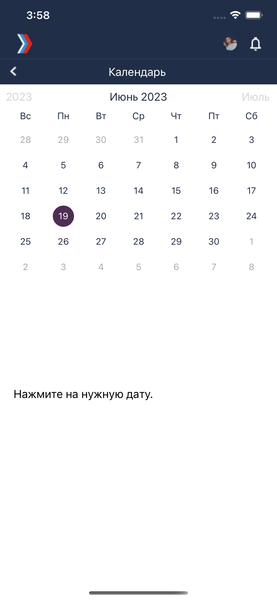
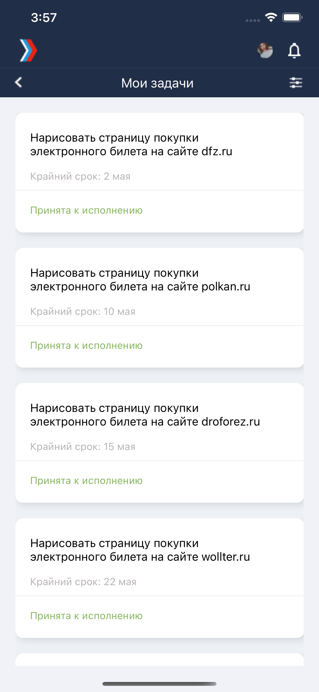
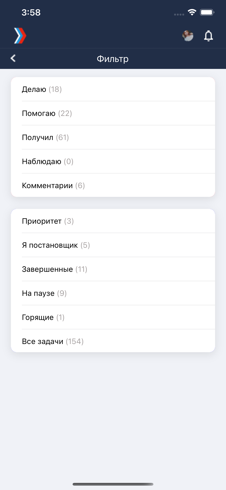

# TestApp
`Swift`

Описание для приложения.
# Иконка приложения на экране телефона

# Ввод логина и пароля

# Восстановление пароля

# Главное меню

# Календарь

Удобный календарь с пометкой на дне дедлайна и описанием.

# Все задачи

Просмотр всех задач поставленных пользователю на данный момент.

# Описание задачи

Здесь менеджер может менять статус задачи и редактировать ее.

# Фильтры задач

# Новая задача

# Добавление нового пользователя

Добавлять пользователь может только менеджер, также он может добавить другого менеджера.

# Сообщения

Приложение подразумевает передачу сообщений между зарегестрированными пользователями, сообщения хранятся в Firebase. Последнее сообщение отображается в списке диалогов.

# Медиа в сообщениях

Присутствует возможность добавление медиа/видео/аудио файлов.

# Карточка пользователя

# Данные контакта

Данные контакта заполняются при регистрации (добавления) нового пользователя.

 Все данные хранятся в Firebase/Realtime Database и Firebase/Firestore Database. Авторизация утроена в Firebase/Authentication.

